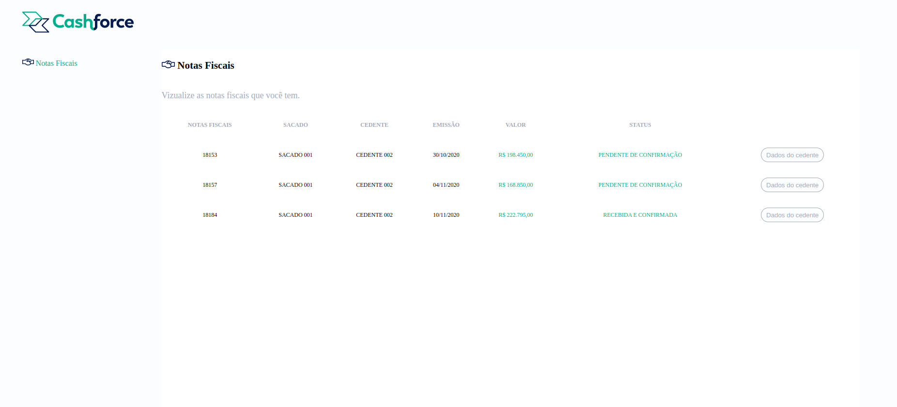

# Fullstack Cashforce



# Contexto
Projeto de uma aplicação fullstack com api de consulta em banco de dados MySQL, através da ORM Sequelize, para vizualição de Notas Fiscais registradas no mesmo.

## Técnologias usadas

Front-end:
> Desenvolvido usando: Vue, TypeScript, Axios, Eslint, Prettier

Back-end:
> Desenvolvido usando: NodeJS, ExpressJS, TypeScript, MySQL, Sequelize, Cors, Nodemon, Dotenv, Jest, Mocha, Sinon, Chai

## Rodando com Docker

 * Clonando o  repositório:

  ```
  git clone git@github.com:DouglasD18/cash-fullstack.git
  cd cash-fullstack
  ```

* Rodando docker-compose
  ```
  docker-compose up
  ```

## Rodando sem Docker

### Instalando Dependências

> Backend
```bash
cd backend/ 
npm install
``` 
> Frontend
```bash
cd frontend/
npm install
``` 
### Executando aplicação

* Para rodar o backend:

  ```
  cd backend/ && npm start
  ```

* Para rodar os testes do backend:

  ```
  cd backend/ && npm run test
  ```

* Para rodar o frontend:

  ```
    cd frontend/ && npm run serve
  ```

Aplicação rodando na porta http://localhost:8080/